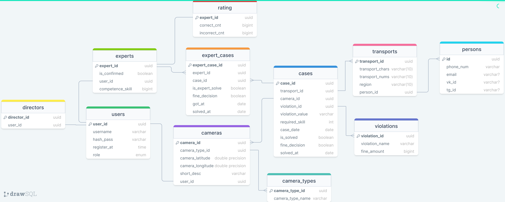
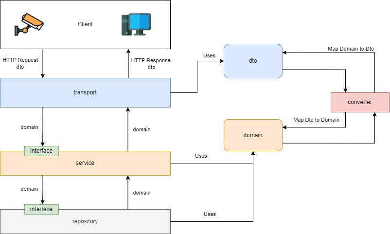

# Backend Traffic Police
Тестовое задание в RTUITLab

# Стек проекта
Общий стек проекта:
1. Go 1.22
2. PostgreSQL 16
3. RabbitMQ
4. Docker и Docker Compose
5. Swagger

Используемые библиотеки:
1. pgx - драйвер для PostgreSQL
2. swaggo - преобразует аннотации Go в документацию Swagger
3. amqp091-go - для работы с RabbitMQ  из Go
4. migrate - для работы с миграциями БД

Я не использовал веб фреймворки, так как Go имеет сильную стандартную библиотеку и использование веб фреймворка не было необходимостью.

# Описание 
В системе существует 3 вида пользователя:
1. Директор - руководители, которые регистрируются программно (через конфиг)
2. Эксперт - специалист, оценивающий случай
3. Камера - отправляет данные о случае на сервер

Идентификация и аутентификация пользователей происходит по username и password пользователя.

Авторизация пользователей производится спомощью JWT токена.

Система работает следующим образом: на сервер поступает информация с камер - фотография проишествия и данные в виде одной байтовой строки. Сервер эти данные сохраняет для дальнейшей оценки экспертами. Данные поступают с различных видов камер, на данный момент в проекте поддержаны только "camerus1", "camerus2", "camerus3".

Каждая камера регистрируется в системе. При регистрации Помимо основной информации о камере, также необходимо передавать username и password. Это сделано так, потому что камера является отдельным пользователем системы, и также получает JWT токены для авторизации. Загружать фотографию проишествия и информацию может только камера.

Информация о контактных данных и правонарушениях импортируется из excel файлов. Для импорта нужно обратиться к соответствующему эндпоинту.

Обработка фотографии реализована в соответствии с алгоритмом, описаном в тестовом задании. Значение консенсуса передается в конфиг файле. Когда случай становится оцененным, то в таблице рейтинга обновляется количество правильных или неправильных оценок для каждого оценившего эксперта.

Рейтинг реализован в соответствии с алгоритмом, описанным в тестовом задании. Запускается отдельная горутина, которая раз в отчетный период (передается в конфиге), рассчитывает 10% экспертов с наилучшим рейтингом и 10% с наихудшим рейтингом, для которых изменяется рейтинг. Также для рейтинга учитывается минимальное количество экспертов (передается в конфиге), которые решили не менее j случаев (передается в конфиге). Так как рейтинг хранится в отдельной таблице, то он доступен в любой момент времени.

Эксперты имеют возможность обучаться на решенных случаях. Случаи можно фильтровать по определенным полям, указанным в документации.

Отправка штрафа происходит с помощью очереди сообщений RabbitMQ.

Swagger документация будет доступна после запуска проекта по адресу: http://localhost:8080/docs

## Описание базы данных

Таблицы:

users - хранит данные для аутентификации и авторизации пользователей

directors, experts, cameras - виды ролей в системе. 

camera_types - хранит информацию о типах камер.

transports - хранит информацию контактную информацию о различных транспортах.

persons - хранит информацию о владельцах каждого транспорта.

violations - хранит информацию о правонарушениях

cases - таблица, которая хранит основную информацию о случаях.

expert_cases - хранит информацию об оценках экспертов по каждому случаю.

rating - хранит текущую информацию о рейтинге экспертов по количеству правильно и неправильно решенных случаев.

## Описание общей архитектуры проекта


В проекте используется чистая архитекрута, где 3 слоя: транспортный, сервисный (бизнес логика), репозиторий. Каждый выше стоящий слой зависит от ниже стоящего через интерфейс, что дает гибкость. Также благодаря этому реализовано юнит тестирование. Для тестирования транспортного или сервисного слоя, мокается интерфейс нижестоящего слоя. 

Для транспортного слоя используются модели dto, а для сервисного слоя и репозитория используются модели domain. Для передачи данных между транспортным и сервисным слоем используется converter, который мапит dto модели в domain модели и наоборот. Использование отдельных моделей для репозитория я посчитал излишним. Такое разделение моделей позволит легко изменять взаимодействие с бэкендом (например, добавить взаимодействие по gRPC или GraphQL).

Проект состоит из 2 сервисов:
1. service - основной сервис, который занимается всей логикой приложения, принимает запросы от клиентов, обрабатывает и возвращает ответ.
2. fine_notification - сервис, который занимается отправкой уведомлений по доступным каналам свзяи (В проекте реализовано только уведомление по почте).

Эти 2 сервиса связаны через очередь сообщений RabbitMQ. Принцип работы прост: service отправляет сообщение в очередь fine_notification читает сообщение и отправляет уведомление.

Для авторизации используется Middleware, который парсит JWT токен. В этом токене зашит айди пользователя и его роль. По роли пользователя проверяется возможность доступа к ресурсу, а по айди пользователя проверяется, что эксперт подтвержден директором.

# Запуск проекта
### 1. Установить Docker
Для запуска проекта необходим Docker.

### 2. Создать конфиг файл для service
 В директории service (`cd service`) необходимо создать конфиг файл `service_config.yaml`, который имеет следующую структуру:
``` yaml
consensus: <int: Необходимое количество проверок специалистов для оценки случая> 

passSalt: <string: Соль для хеширования паролей>
signingKey: <string: Ключ подписи JWT токенов>

rating: <Информация для рейтинга>
  reportPeriod: <duration: Время отчетного периода. Формат hms>
  minSolvedCases: <int: Минимальное количество решенных кейсов экспертом для его оценки в отчетный период>
  minExperts: <int: Минимальное количество экспретов для оценки рейтинга. Минимально - 3>
  
postgres: <Информация о БД>
  user: <string: Имя пользователя БД>
  password: <string: Пароль пользователя БД>
  host: <string: Хост БД>
  port: <int: Порт БД>
  database: <string: Наименование БД>

rabbitmq: <Информация о RabbitMQ>
  user: <string: Имя пользователя RabbitMQ>
  password: <string: Пароль пользователя RabbitMQ>
  host: <string: Хост RabbitMQ>
  port: <int: Порт RabbitMQ>

directors: <array: Массив директоров>
  - username: <string: Имя директора>
    password: <string: Пароль директора>
```

Пример для service_ config.yaml (Можно просто копипастить):
``` yaml
consensus: 2

passSalt: "salt"
signingKey: "sign"

rating:
  reportPeriod: 8h
  minSolvedCases: 1
  minExperts: 3

postgres:
  user: "user"
  password: "user"
  host: "postgres"
  port: 5432
  database: "traffic_police_db"

rabbitmq:
  user: "guest"
  password: "guest"
  host: "rabbitmq"
  port: 5672

directors:
  - username: "director1"
    password: "director1"
  - username: "director2"
    password: "director2"
```
### 3. Создать конфиг файл для fine_notification
В директории fine_notification (`cd fine_notification`) необходимо создать конфиг файл `notification_config.yaml`, со следующей структурой:
``` yaml
emailSender: <Информация об отправителе сообщений по почте>
  host: <string: Хост отправителя сообщений>
  port: <string: Порт отправителя сообщений>
  username: <string: Имя пользователя отправителя сообщений>
  password: <string: Пароль пользователя>
  subject: <string: Заголовок сообщения о правонарушении>


rabbitmq: <Информация о RabbitMQ>
  user: <string: Имя пользователя RabbitMQ>
  password: <string: Пароль пользователя RabbitMQ>
  host: <string: Хост RabbitMQ>
  port: <string: Порт RabbitMQ>
```

Пример для notification_config.yaml. Для отправителя сообщений проще всего использовать smtp сервер gmail и пароль приложения в gmail.
``` yaml
emailSender:
  host: "smtp.gmail.com"
  port: 587
  username: "emailsender@gmail.com"
  password: "secret"
  subject: "Информация о правонарушении"


rabbitmq:
  user: "guest"
  password: "guest"
  host: "rabbitmq"
  port: 5672
```

### 4. Запустить контейнеры
```
docker compose up -d
```

### 5. Работа с системой
Запросы к сервису осуществляются по порту 8080 `http://localhost:8080`

База данных PostgreSQL работает на порту 5440

Веб интерфейс RabbitMQ работает на порту 15672
